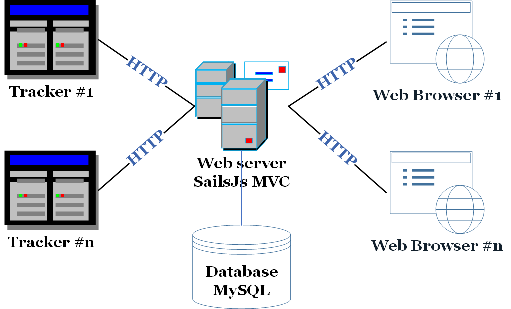
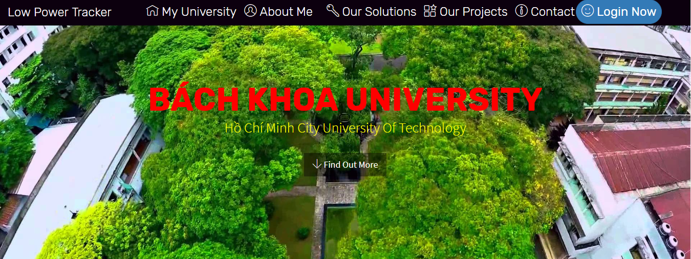
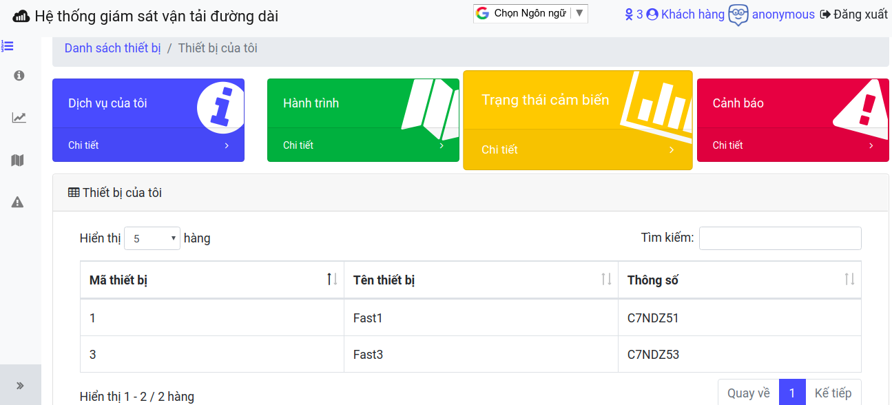
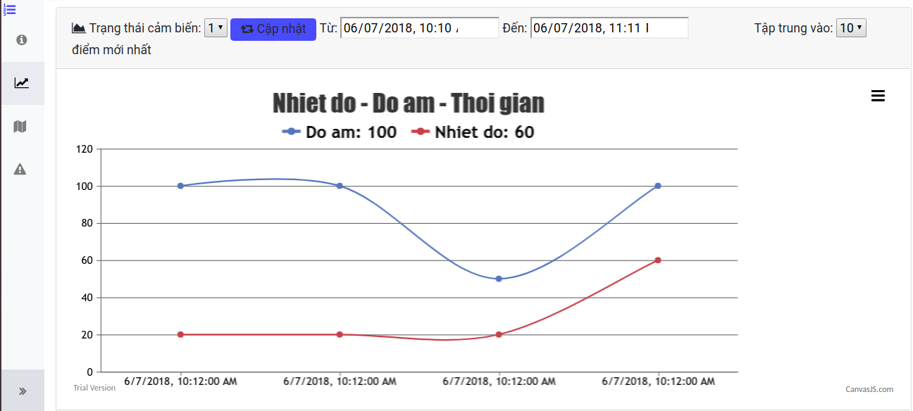
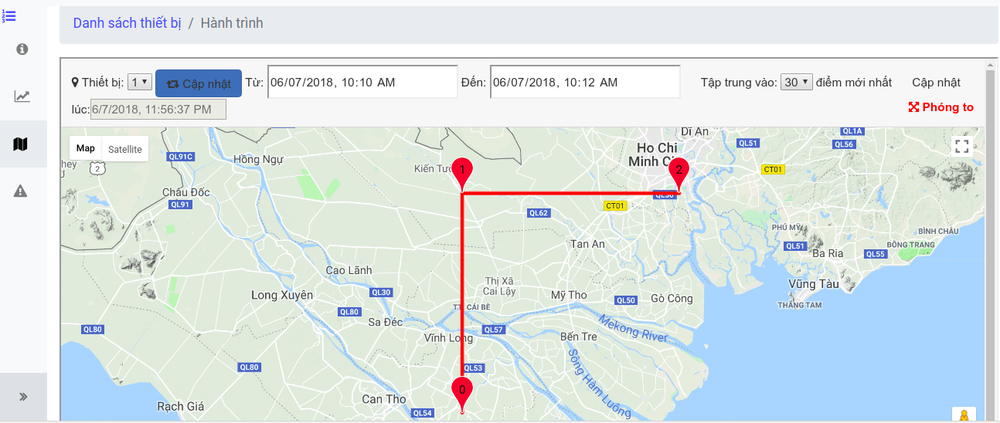
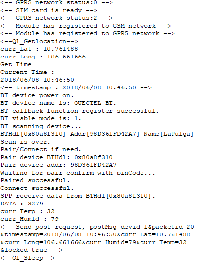
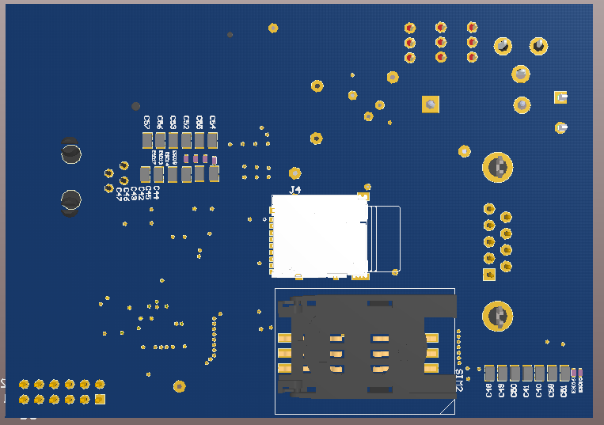
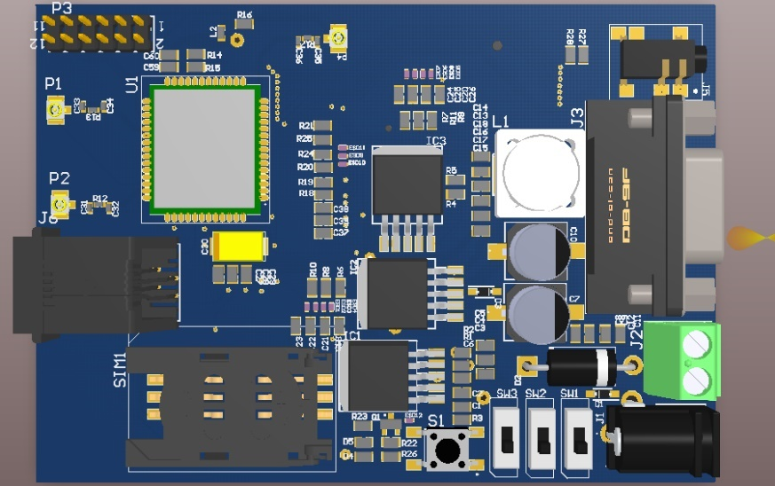

# **Long-Distance-Transportation-Monitoring-System**
In this project, we did make a Tracker and a real system that has been on the markets. This tracker is specially designed for portable and low power so that it can get along with the carriers for a months.

## Description
This system is made up of 2 main parts, a web server and trackers. Web server is powered by SailsJS MVC and MySQL database to collect humidity, temperature and coordinates of trackers. It also provides web service to users to monitor their packages (containers, ...). Front-end is designed to monitor their package via grap, google maps and some warning protection.

## System model
<p align="center">
  
</p>

## Getting Started
These instructions will get you a copy of the project up and you can develop it for further purposes. See deployment for notes on how to deploy the project on a live system.

### Prerequisites
What things you need to have before operating the whole system
```
A server powered by Linux can run nodejs environment.
MySQL is installed on that server.
SailsJs application
```

### Installing
What you need to install
```
Ubuntu 16.04 or higher or other Linux Distros
nodejs: https://nodejs.org/en/
Sailsjs: https://sailsjs.com/get-started
mysql (I use Ubuntu): sudo apt-get install mysql-server mysql-client
```	

## Hierachy of Project
There are four main folder in this project:  **Web Server**,  **Tracker**,  **Doc**.

**Document** contains such files as *.pdf*, *.docx*, etc describing the whole of our project.
**Web Server** stores code that executed on a Linux Distro based PC.
**Tracker** contains code run on MC60 Kit.

## Deployment
At first, you should setup config/local.js. Add your MySQL information in it.
Secondly, navigate to Web Server root folder and hit ```./start.sh```.
Finally, power on your Kit

## Some results
<p align="center">
  
</p>

<p align="center">
  
</p>

<p align="center">
  
</p>

<p align="center">
  
</p>

<p align="center">
  
</p>

<p align="center">
  
</p>

<p align="center">
  
</p>

## Team members

* **Phuong Le Van Hoang** - **Leader**, *Operating Platform Development*, *Web Server*
* **Nhan Huu Nguyen** - *Firmware Development*
* **Hieu Trung Nguyen** - *Hardware Design*

